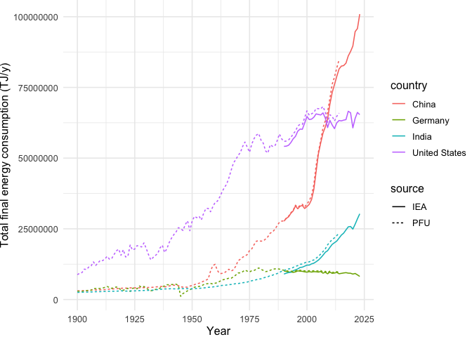
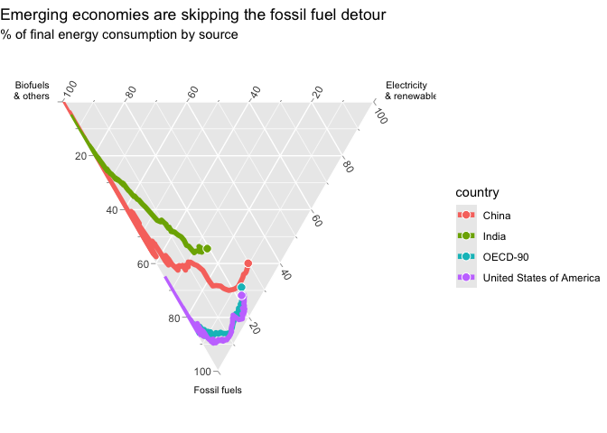
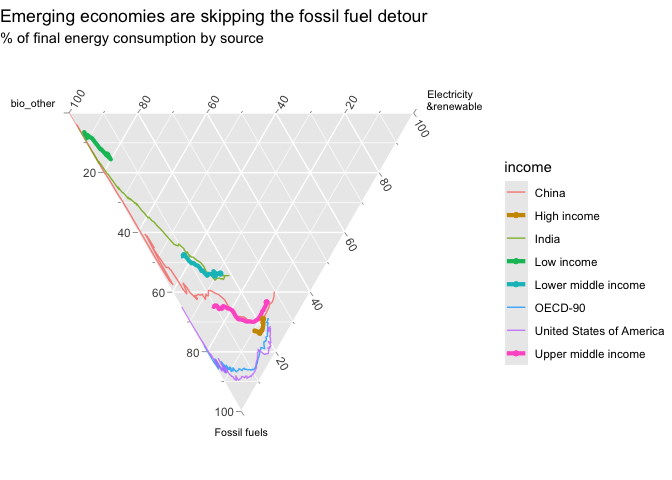
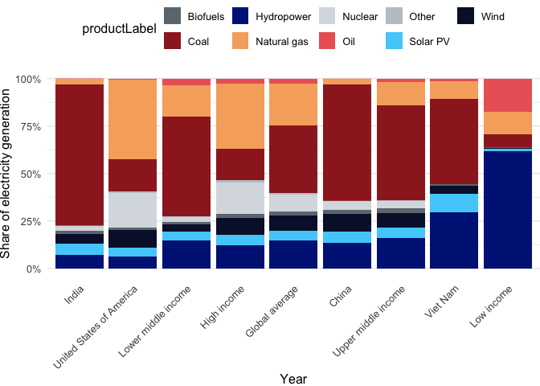

# Introduction

Today, the cheapest way to power a society, is green, clean, renewable
electricity. We’ll show the “fossil fuel detour” taken by the West, and
how some of the poorest countries in the world are building better from
the start.

*In this repository, you will find the methodology, data and code behind
the stories that came out of this analysis.*

**Watch the video here:** [Planet A](https://www.dw.com/a-xxx)

**Story by:** [Kira
Schacht](https://www.dw.com/en/kira-schacht/person-46893544)

- `analysis.Rmd` is the main file that contains the R code for the
  analysis
- `data/...` contains the raw data files used in the analysis

# Read data

## UN Country metadata

- [UN Country isocodes and continent/regional
  affiliations](https://unstats.un.org/unsd/methodology/m49/overview/)
- [World Bank income
  groups](https://datahelpdesk.worldbank.org/knowledgebase/articles/906519-world-bank-country-and-lending-groups)

## GDP data

[Penn World Table version
11.0](https://www.rug.nl/ggdc/productivity/pwt/?lang=en): Output-side
real GDP at chained PPPs (in mil. 2021US\$) per capita

## Historical energy data

[Primary, Final and Useful Energy Database
(PFUDB)](https://iiasa.ac.at/models-tools-data/pfudb): Final energy
consumption by source (TJ/y) and population (1000 persons), for select
regions & countries.

## IEA Energy Data

- Energy consumption by fuel
- Electricity generation by fuel

## Merge PFU data with IEA data

Check how similar the two datasets are:

<!-- -->

## Merge energy data with GDP data, add country metadata

## Assign electricity and energy types to classes

| type | productLabel |
|:---|:---|
| fossil | Coal, Natural gas, Oil, Coal and coal products, Primary oil, Oil and oil products, Natural gas, Oil products |
| other | Biofuels, Nuclear, Other sources, Waste, Biofuels and waste, Heat, Nuclear |
| renewable | Geothermal, Solar thermal, Hydropower, Solar PV, Tide, Wind, Electricity, Solar, wind and other renewables, Hydropower |
| NA | Total |

# Energy consumption

## How did countries’ energy mixes change over time?

Total final consumption (TFC) by source over time

### Baseline countries: USA, India, China, OECD

Energy consumption shares: Fossil vs biomass vs electricity&renewable

<!-- -->

<!-- -->

# Electricity mix over time

## Current electricity mix by country

    ## # A tibble: 5 × 2
    ##   income              renewable
    ##   <chr>                   <dbl>
    ## 1 High income             0.298
    ## 2 Low income              0.496
    ## 3 Lower middle income     0.394
    ## 4 Upper middle income     0.220
    ## 5 <NA>                    8.40

## Column chart of current electricity sources:

Income group averages, China, India, Vietnam, US, Global average

<!-- -->
